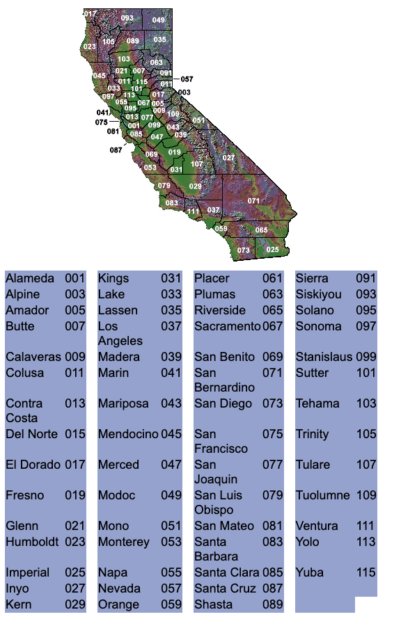

All files necessary to run EDA pushed to repo except for the whole state of CA snapshot TIF.  Comment those blocks out in EDA file to run without it.  (note, you must have run the scripts described below to have the files necessary to display the last few loops in the EDA notebook.)

To pull cropscape data with scripts by example area bounding box:

run pull_2010_thru_2023.sh
This will pull all years from 2010 until 2023 and name the files with year in the same directory the file was run from.

Alternatively you can run pull_cs_tif.sh to pull one year at a time, you must specify the year with the -y flag and target year (" -y 2023")

Addition on June 9th 2024:
Added another script to pull by county.
If you run pull_monterey_2010_thru_2023.sh it will do the same as the script above but for Monterey county.

Alternatively you can run pull_cs_tif_by_fips.sh to specify one year and county (" -y 2023 -c 06053").
Note: County is identified by "FIPS" code.  For the cropscape API it is 5 digits, 2 for state and 3 for county.  CA FIPS start with 06, and the counties are show in the image below.  For example: Monterey's suffix is 053, so the whole code is 06053.

